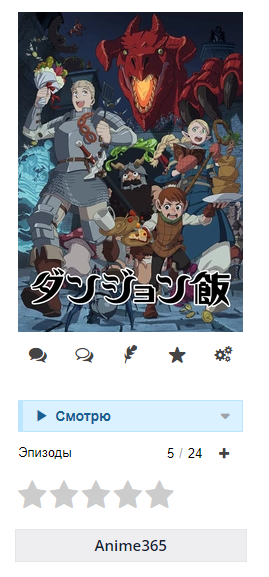
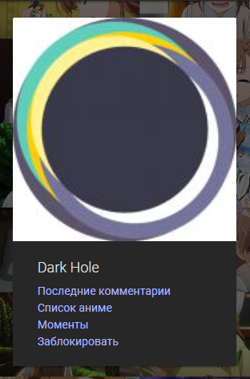
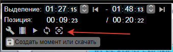
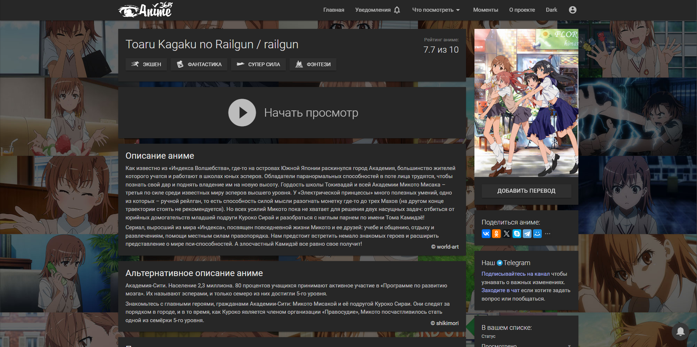
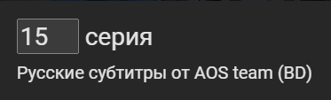

Коллекция пользовательских скриптов для Anime365
=========

## Как установить?
1. Установить менеджер пользовательских скриптов. Рекомендуется [ViolentMonkey](https://violentmonkey.github.io/), но может работать и в TamperMonkey/GreasyMonkey.
2. Перейти по ссылке для установки скрипта
3. Согласиться с установкой
4. Готово

## Список пользовательских скриптов
Нажмите на название скрипта, чтобы установить его
* [anime365-links](https://github.com/DarkHole1/userscripts/raw/main/anime365-links.user.js) - добавляет под постерами на Шики ссылку на тайтл в 365.

  
* [autonext](https://github.com/DarkHole1/userscripts/raw/main/autonext.user.js) - автоматически переключается на следующую серию при достижении конца. Режим полного экрана НЕ сохраняется, следующая серия автоматически НЕ запускается.
* [block365](https://github.com/DarkHole1/userscripts/raw/main/block365.user.js) - убирает комментарии заблокированных пользователей и добавляет кнопку "заблокировать" в профилях пользователей.

  
* [blockautoprogress](https://github.com/DarkHole1/userscripts/raw/main/blockautoprogress.user.js) - блокирует отметчание серий просмотренными для самого Anime365.
* [goto-preview](https://github.com/DarkHole1/userscripts/raw/main/goto-preview.user.js) - добавляет кнопку в режиме создания клипа, для перехода к кадру, которй будет использоваться как превью.

  
* [misaka](https://github.com/DarkHole1/userscripts/raw/main/misaka.user.js) - заменяет фон на сайте на случайный коллаж из скриншотов с Мисакой; адаптирован с официального сайта франшизы.
  

    
Скриншот работы скрипта

    
    
  
  

* [position-saver](https://github.com/DarkHole1/userscripts/raw/main/position-saver.user.js) - сохраняет позицию просмотра локально и восстанавливает её для продолжения просмотра. Не работает вместе с `remote-position-saver`.
* [remote-position-saver](https://github.com/DarkHole1/userscripts/raw/main/remote-position-saver.user.js) - то же, что и `position-saver` только сохраняет её на стороннем сервере и работает между браузерами/устройствами. Не работает вместе с `position-saver`.
* [quickswitch](https://github.com/DarkHole1/userscripts/raw/main/quickswitch.user.js) - добавляет вместо номера серии поле ввода, с помощью которого можно перейти к любой серии.

  
* [reverse-cover](https://github.com/DarkHole1/userscripts/raw/refs/heads/main/reverse-cover.user.css) - меняет обложки и превью местами (при наведении превью, по умолчанию обложка)

## Известные проблемы
* quickswitch не работает с другими эпизодами, кроме TV, а также с дробными эпизодами.
